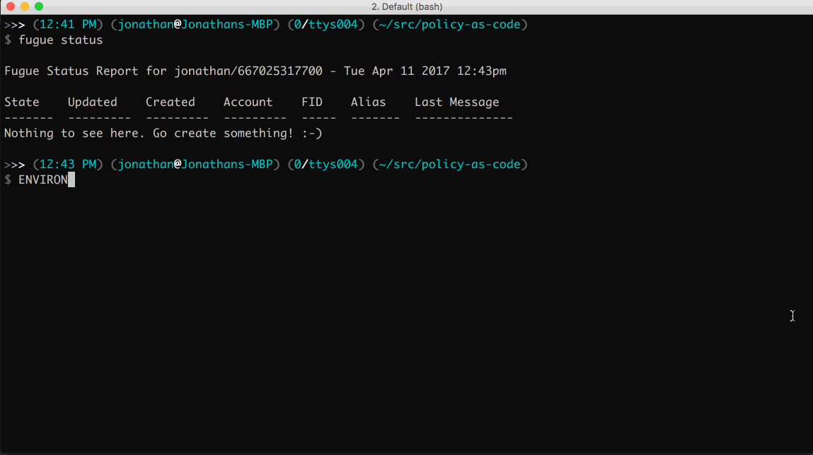
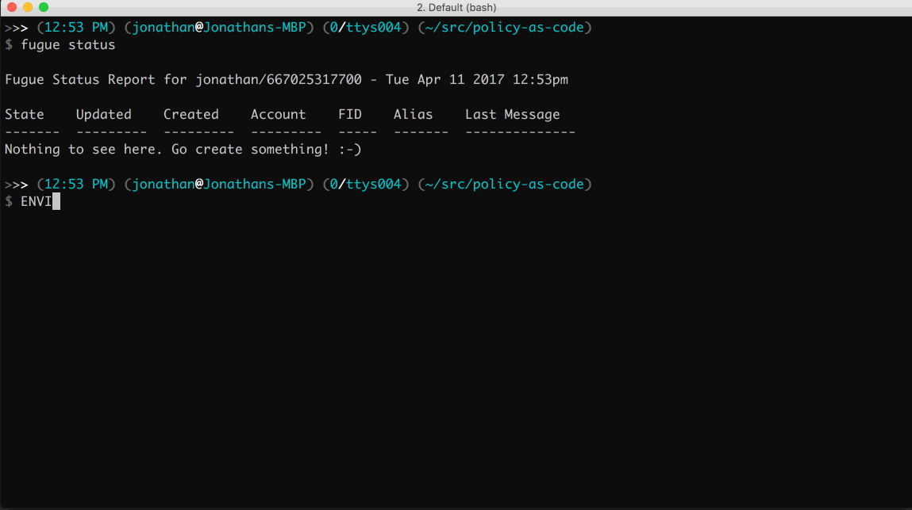
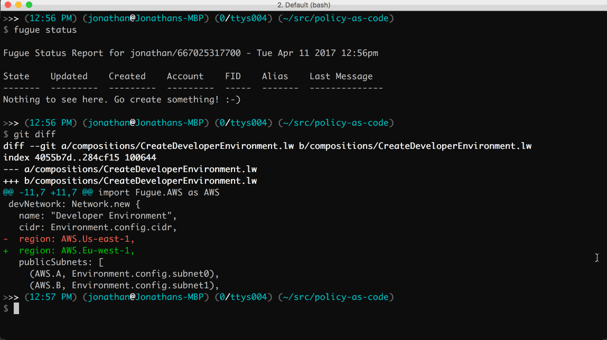
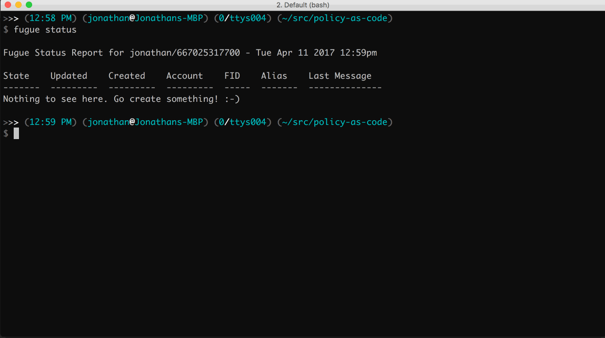
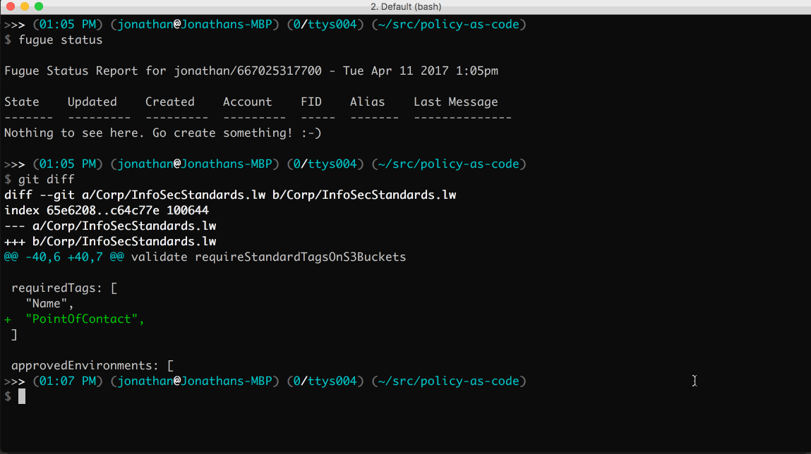
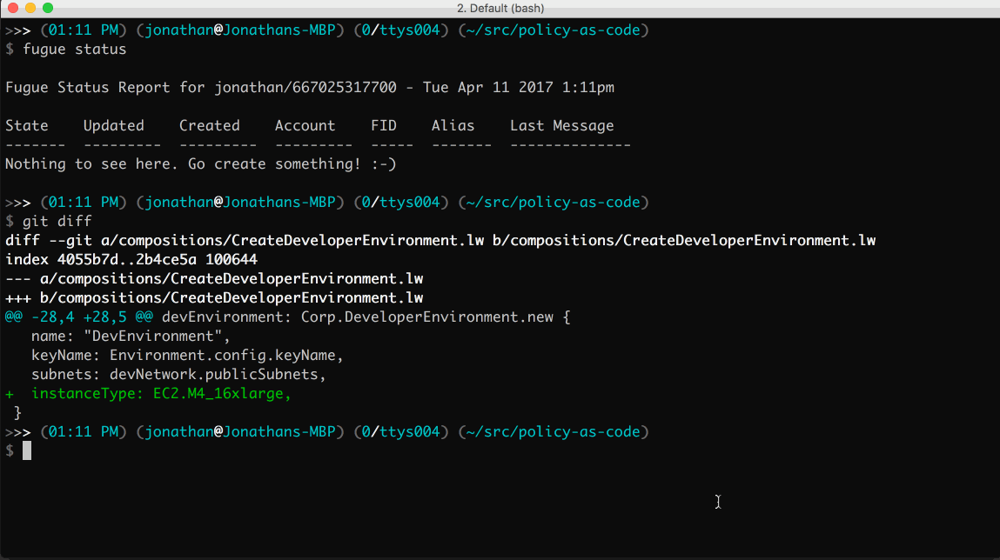

# Policy As Code

## Compile Time Validations

We can validate our infrastructure by ensuring all our compositions and Ludwig libraries compile. That's what the `Makefile` does for you. We'll run through some categories of validation below.

```
$ ENVIRONMENT=DEV make
```



### Environments: Only allow approved environments.

```
$ ENVIRONMENT=DOESNOTEXIST make
```



### Regions: Only allow `us-east-1`.

```
$ ENVIRONMENT=DEV make
```



### Ports: SSH allowed for DEV environment *only*, disallowed for QA and PROD.

```
$ ENVIRONMENT=DEV make
$ ENVIRONMENT=QA make
$ ENVIRONMENT=PROD make
```



### Tags: All assets that can be tagged must have specific standard tags applied.

```
$ ENVIRONMENT=DEV make
```



### InstanceTypes: Limit allowed instances types on a library-by-library basis.

```
$ ENVIRONMENT=DEV make
```


